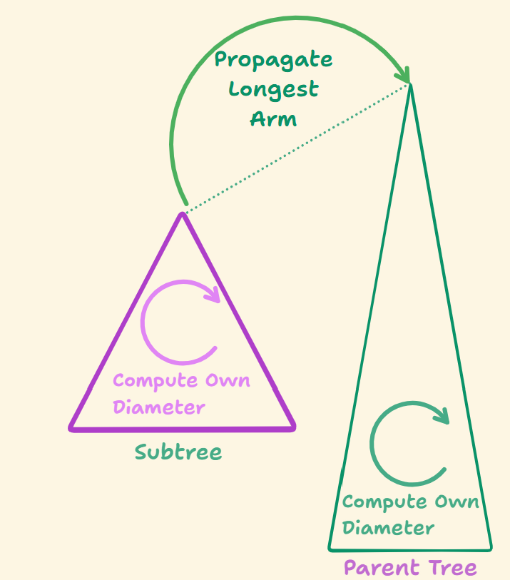
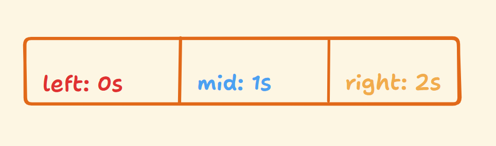
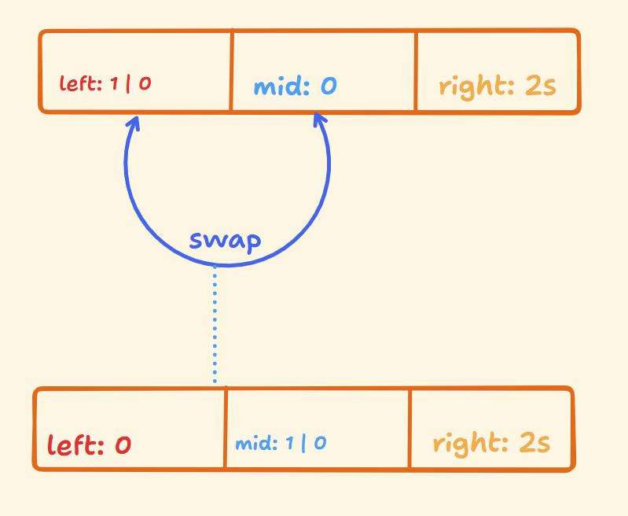

While solving leetcode, I have found that construction of solutions requires a insightful sketch of the core thought process. Insights are unique from person to person, some concept trivial to person A might be really non trivial for person B. This post is my attempt to put the construction principles across three problems to hopefully illustrate how naturally solutions can be derived.

## Problem 1: Diameter of a Binary Tree.

**Diameter of a binary tree**: It is defined as the longest path between any two nodes of a binary tree. It is not necessary that the longest path passes through the root itself. Quite literally: $$\texttt{max}({\tt len(a, b) })$$ where $\texttt{a, b}$ are any two nodes of the given binary tree.

The given problem is [Leetcode 543](https://leetcode.com/problems/diameter-of-binary-tree/).
The first insight that can be obtained here is that, the concept of a "diameter" only exists for a binary tree (can be the rooted tree, or a subtree), there is no concept of diameter of a node. This is insightful for a number of reasons:

```cpp
int diameterOfBinaryTree(TreeNode* root) {
    // TODO
}
```

1. The function we are asked to implement in [Leetcode 543](https://leetcode.com/problems/diameter-of-binary-tree/) necessarily returns a number, which is fine as length is a number, but we operate through one node! This is slightly convoluted but usually `TreeNode* root` is the node at a time.
However, if you recall the diameter is defined for any two nodes. 
2. Often you will hear that "the diameter is defined as height of the left subtree + height of the right subtree" but this does not make much sense as, diameter as a concept exists for a binary tree and not a node. Nowhere they mention: the diameter of what exactly!? (**Unless** you realize this is a corollary: if the longest path is required to go through some specific node, it must be this sum, because taking the longest branch on both sides maximizes the total length of the path.) 

If you do consider the "Unless.." then this does gives us a recipe to get the diameter of a subtree! It will be used soon.

The second and more critical insight that can be only be observed abstractly is that in order to get a max length path, a **subtree** needs to first:

1. Identify its own max length path (its own diameter). This will be one of the candidates that can be tried and tested to check if this diameter is the globally the best (max).
2. Propagate or contribute the length of the longest branch or arm to the parent so the parent (which itself is a binary tree, remember!) can execute (1.) as written above.

The recursive structure is clear from (2.) above, this essentially provides the bottom up machinery we need to construct the algorithm further. The last part of the puzzle is what is the order of traversal? Well, this answer is not as straight forward as other problems like calculating the maximum height or printing nodes. 

The key is to observe that we necessarily have to dive deep towards a subtree, let it do its thing, propagate. There are two subtrees possible in a binary tree. Implying the order must be Left-Right-Node (or, Right-Left-Node really) hence postorder traversal it is!

{: width="65%"}

We can now start filling in the blanks:

```cpp

int traversal(TreeNode* node, int& global_best) {
    if (node == nullptr) return 0;

    // go left and right
    int left = traversal(node->left);
    int right = traversal(node->right);

    // Get the diameter for the subtree we are in.
    int subtree_sum = left + right;
    // Test it if it is worthy of being a global best
    global_best = max(global_best, subtree_sum);

    // Propagate longest arm to parent to let parent be the subtree and do its thing
    return 1 + max(left, right);
}

int diameterOfBinaryTree(TreeNode* root) {
    int global_best = 0;
    traversal(root, global_best);
    return global_best;
}

```

## Problem 2: Dutch National Flag Problem

This one is a [well studied](https://en.wikipedia.org/wiki/Dutch_national_flag_problem) problem and roughly it asks, how do we sort an array where each element is from one of three categories? Often, the problem is framed as to sort an array with only 0s, 1s, and 2s.

The bruteforce algorithm, which is simple, is slightly tricky to think about if attempted on a whim. Those who have not seen the 'proper' solution will default to a bruteforce approach. The idea is to keep a count of each of the elements from the three categories, say Zeroes, Ones and Twos and then overwrite the array using the counts. Simple yet not super clear to come up with.

The better approach as required is much more clever and quite different than how a sorting task would be conducted. We still have comparisons and insertions but traversal logic is a lot different. The closest analogous operation would be to clear a pile of clothes where only three types of clothes are there: We can simply pick one of the three types and put it to the left, similarly pick the other type and put it to the right and we are guaranteed that the middle pile will be the last type, essentially sorting each into their own piles.

This idea can therefore be applied to create a one scan algorithm: 

Let the left be from index 0, the right be from index `len(array) - 1`, decreasing. We then proceed to fix a convention i.e. let the middle (mid) pile be only the 1s. Similarly left indexed pile be 0s and the right indexed pile be 2s.

{: width="65%"}

What this allows us is if we encounter an array element indexed by mid to be 1, we simply move mid ahead to index the next element. If the element indexed by mid is a 0, we swap the mid indexed element with the left indexed element so as to make left follow the convention that it must hold 0s and mid should only index 0s and move both left and mid indexes forward. Lastly, if mid indexed element is a 2, we similarly swap and decrement the right indexer. 

{: width="65%"}

The element at the left pointer is always either a 1 (if left is trailing behind mid) or a 0 (if left and mid are at the same spot)

Note in the last step we do not decrement or increment the mid indexer, doing this would mean mid now no longer points to the currently swapped element from `array[right]` which could have been any of 0s or 1s, to handle it in the next iteration we do not modify mid. 

We do need to do this for when `array[middle]` is a 0 however since `array[left]` can not be a 2, as we are traversing with mid from left to right, everything behind mid is guaranteed to be "nice" (i.e, have only 0s or 1s), if it is a 0, we still move ahead as middle has done its job of making left fine, and if it is a 1 then that is the golden case.


```cpp
void dnf(int array[], int n) {
    int left = 0, middle = 0, right = n - 1;

    while (middle <=  right) {
        if (array[middle] == 1) {
            // Middle is 1, fine so move
            middle += 1;
        } else if (array[middle] == 2) {
            // Not fine, right must be 2.
            swap(array[middle], array[right]);
            right -= 1; // Current right became fine, so point to the next right
        } else if (array[middle] == 0) {
            // Not fine, left must be 0
            swap(array[middle], array[left]);
            left += 1;
            middle += 1;
        }
    }
}
```


## Problem 3: Quick Select

A common question that is asked is: How do we find the Kth largest value in an array? 

It is not very obvious how quick select is used here, the usual ideas of sorting or using a heap works fine. So, I will introduce the pseudocode first to hopefully motivate the ideas. Usually, quick sort is a common algorithm taught in various courses, quick select can be derived from some similar ideas.

```python
function partition(array, start, end) {
    pivot is some random index from the array
    pivot_value is array[pivot]

    swap(array[pivot], array[end])
    
    left = start
    for i from start to end - 1 {
        if (array[i] < pivot_value) {
            swap(array[i], array[left])
            left += 1
        }
    }
    
    swap(array[end], array[left])
    return left
}
```

```python
function quickselect(array, target_index) {
    left = 0
    right = array.size() - 1

    loop {
        if (left == right) {
            return array[left]
        } 

        pivot_index = partition(array, left, right)

        if (pivot_index == target_index) return array[pivot_index]
        else if (pivot_index < target_index) {
            left = pivot_index + 1
        } else if (pivot_index > target_index) {
            right = pivot_index - 1
        }
    }
}
```

This is a lot. The first function does this, concisely: Move pivot to the end then compare each element with pivot value so they can be arranged-inserted to the front and finally restore pivot after the arranged-inserted portion. The pivot is swapped into its exact, final sorted position.

The second function: Matches until both target index and pivot index become same, while repeatedly arranging-inserting using partition and based on the current pivot index shrink the search space. 

This does what we want (but from the front, `target_index` is placed). The reason this works is that the pivot placement (i.e., the swap) at the end of `partition()` places the pivot at the correct position if it was sorted. By shrinking and rejecting the non relevant half, this avoids sorting the entire array and instead arrange all pivots required till we get to the target index.